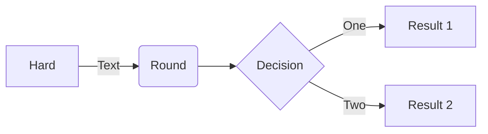
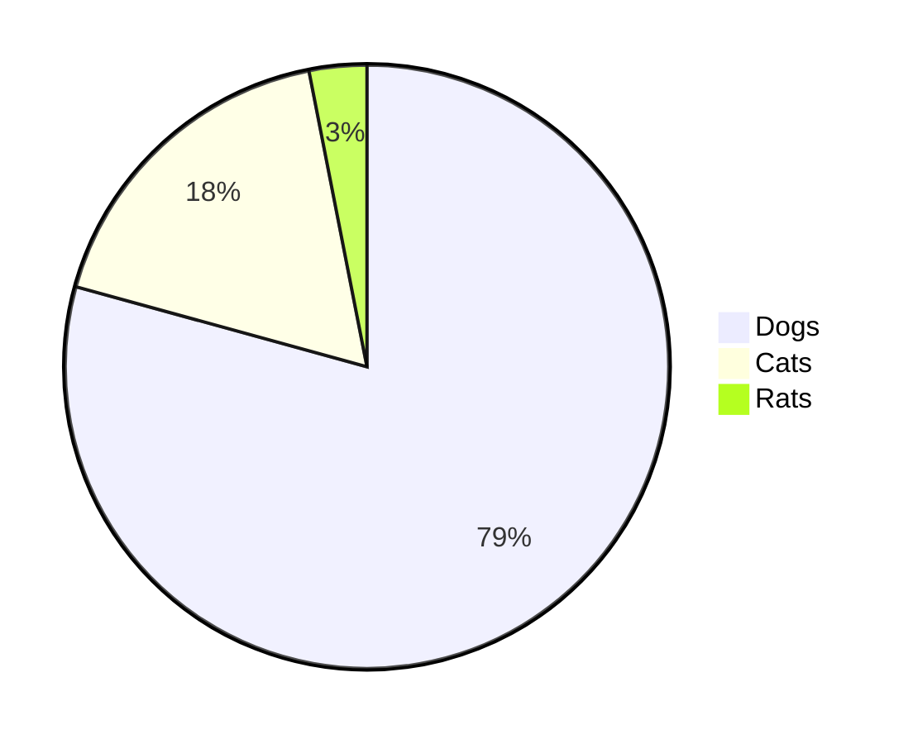
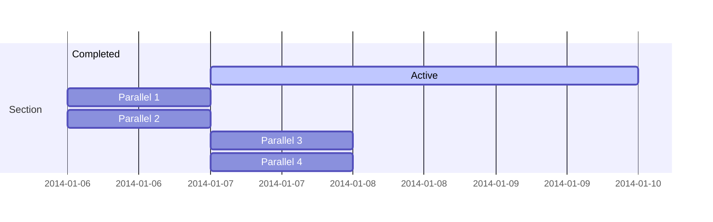

# Markdown Converter

This is a simple markdown converter that converts markdown files to HTML files.

And based on the [@shd101wyy/mume](https://github.com/shd101wyy/mume) package, I made adjustments according to my own needs.

We use `prince` to convert to PDF instead of `puppeteer` because is not support convert TOC to the PDF bookmarks.

### Installation

```bash
npm install
```

### Usage

```bash
node markdown2html.js <markdown file path>
```

### Example

```bash
node markdown2html.js test\markdown.md
```

### TODO

- [ ] Use `puppeteer` to convert to PDF and find a workaround way to support TOC to the PDF bookmarks.

---





